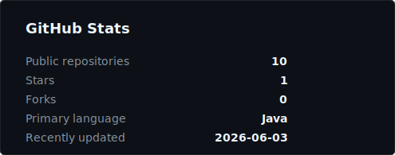
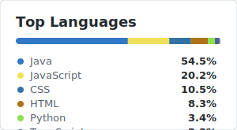

# B-i-i-t

Infrastructure / Linux / HomeLab focused student portfolio.

Building tools for self-hosted environments, automation, and web applications.

---

## Focus

- Linux / Server Administration
- Proxmox VE / HomeLab
- Tailscale / Private Networking
- Ansible / Configuration Management
- Shell scripting
- TypeScript / Web applications
- Java / Backend applications
- Python / Automation
- Azure / Serverless

## Featured Projects

| Project | Description | Stack |
|---|---|---|
| [AgentPad](https://github.com/B-i-i-t/AgentPad) | Web-based tool for operating a Linux development environment from an iPad | Linux, PTY, Docker, PWA |
| [Tailscale Waybar Module](https://github.com/B-i-i-t/Tailscale-Waybar-Module) | Waybar module for displaying Tailscale connection status | Shell, Tailscale, Waybar |
| [School Automation Tool](https://github.com/B-i-i-t/School-Automation-tool-public) | Web tool using GitHub Pages, Azure Functions, and Gemini API | JavaScript, Azure Functions, Gemini API |
| [Score Management System](https://github.com/B-i-i-t/kadai_Point_Management_Public) | Web application for managing students, subjects, and scores | Java, Servlet/JSP, H2, BCrypt |

## GitHub Activity

  

  

