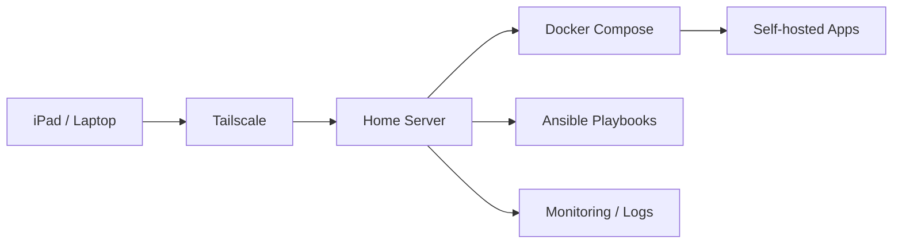

# B-i-i-t

Infrastructure / Linux / HomeLab focused student.  
Building tools for self-hosted environments, automation, and web applications.

---

## Focus

- Linux / HomeLab
- Docker / Docker Compose
- Tailscale
- Shell scripting
- Ansible
- Java / Servlet / JSP
- JavaScript / TypeScript
- Azure Functions

## HomeLab Direction

## Featured Projects

| Project | Description | Stack |
|---|---|---|
| AgentPad | Web-based tool for operating a Linux development environment from an iPad | Linux, PTY, Docker, PWA |
| Tailscale Waybar Module | Waybar module for displaying Tailscale connection status | Shell, Tailscale, Waybar |
| School Automation Tool | Web tool using GitHub Pages, Azure Functions, and Gemini API | JavaScript, Azure Functions, Gemini API |
| Score Management System | Web application for managing students, subjects, and scores | Java, Servlet/JSP, H2, BCrypt |

## GitHub Activity

